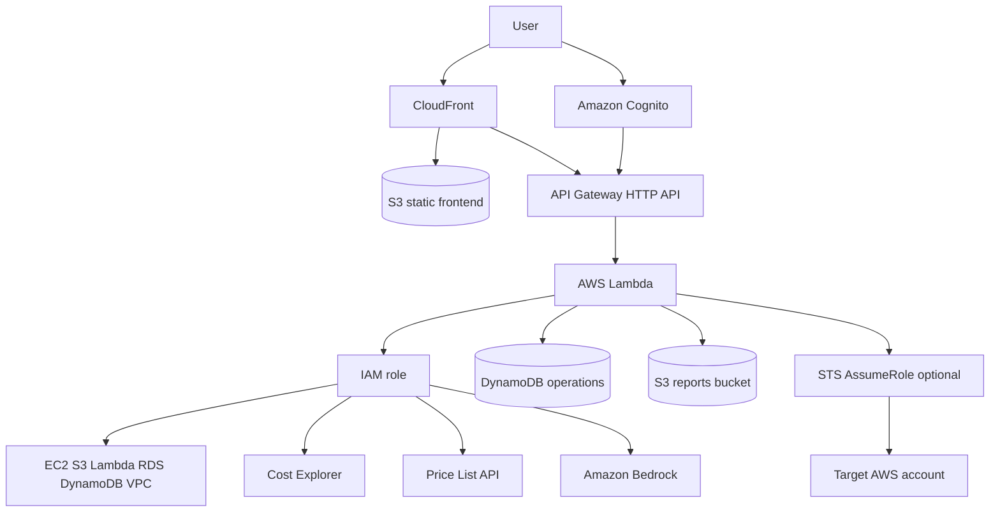

# AWS ResourceLens — Analyze, Estimate & Manage AWS Resources

AWS-native dashboard for signing in with Amazon Cognito, viewing inventory, estimating EC2 cost, comparing spend, creating EC2 with confirmation, generating reports, and optional Bedrock advice.

## Architecture



## AWS services

Cognito, API Gateway, Lambda, DynamoDB, S3, CloudFront, IAM, STS, Cost Explorer, Price List, Bedrock, CloudWatch, CDK.

## Prerequisites

- Node.js 20+
- AWS CLI v2 at `C:\Program Files\Amazon\AWSCLIV2\aws.exe`
- IAM permissions to deploy CloudFormation/CDK in `us-east-1`
- PowerShell (do not use Git Bash)

## Local setup

```powershell
npm install
copy .env.example frontend\.env.local
# fill Cognito and API values after deploy
cd frontend
npm run dev
```

Mock UI only: set `VITE_USE_MOCK=true` in `frontend/.env.local`. Mock mode is not live AWS data.

## AWS deployment (AWS CLI)

From PowerShell in the repo root:

```powershell
npm install
node scripts\deploy.mjs
```

The script uses `C:\Program Files\Amazon\AWSCLIV2\aws.exe` for identity, CloudFormation outputs, S3 sync, and CloudFront invalidation. CDK uses the same default AWS credentials.

Manual equivalent:

```powershell
$AWS = "C:\Program Files\Amazon\AWSCLIV2\aws.exe"
& $AWS sts get-caller-identity
cd infra
npx cdk bootstrap
npx cdk deploy --require-approval never
cd ..
node scripts\deploy.mjs
```

## Cognito

CDK creates a user pool with email sign-up, verification, and SRP sign-in. No access keys are collected. After deploy, open the CloudFront URL, sign up, confirm the email code, then sign in.

## IAM permissions (application Lambda)

Read: `ec2:Describe*`, `s3:ListAllMyBuckets`, `s3:GetBucketLocation`, `lambda:ListFunctions`, `rds:DescribeDBInstances`, `dynamodb:ListTables`, `dynamodb:DescribeTable`, `ce:GetCostAndUsage`, `pricing:GetProducts`, `ssm:GetParameter` (Amazon Linux AMI).

Write: `ec2:RunInstances` and `ec2:CreateTags` limited to small instance types, DynamoDB on the operations table, S3 on the reports bucket, Bedrock invoke on the configured model, optional `sts:AssumeRole` on `ResourceLensTargetRole`.

AdministratorAccess is not used.

## Cost Explorer

Enable Cost Explorer in the account (can take up to 24 hours). Required action: `ce:GetCostAndUsage`. If unavailable the UI shows: `Billing data is unavailable. Please verify Cost Explorer/IAM permissions.`

## Bedrock

Enable model access for `amazon.nova-lite-v1:0` in `us-east-1`. If the model is not enabled, the advisor shows a permission/availability message and does not invent savings.

## Cross-account

Do not paste access keys. In the target account create `ResourceLensTargetRole` that trusts the application account Lambda role. Set Lambda env `CROSS_ACCOUNT_ROLE_ARN` (and optional `CROSS_ACCOUNT_EXTERNAL_ID`). `AssumeRoleService` uses temporary credentials in memory only.

## Security

- No IAM access keys in the browser, source, or DynamoDB
- Cognito JWT on API routes except `/health`
- Private S3 buckets, CloudFront OAC, TLS 1.2+
- Reports via 15-minute signed URLs
- Backend validates region, instance type, storage, and `confirm: true`

## Screenshots

Add captures of login, dashboard, explorer, estimator, create wizard, advisor, and reports after deploy.

## API

| Method | Path | Auth | Purpose |
| --- | --- | --- | --- |
| GET | `/health` | No | Health |
| GET | `/resources/summary?region=` | Cognito | Counts |
| GET | `/resources?region=&service=&q=` | Cognito | Inventory |
| GET | `/resources/{id}?region=&service=` | Cognito | Detail |
| GET | `/billing?region=` | Cognito | Cost Explorer |
| POST | `/estimate` | Cognito | EC2 estimate |
| POST | `/resources/ec2` | Cognito | Create EC2 (`confirm: true`) |
| POST | `/advisor` | Cognito | Bedrock advice |
| POST | `/reports` | Cognito | HTML report + signed URL |
| GET | `/operations/{id}` | Cognito | Create status |

## Tests

```powershell
npm test
```

Covers cost math, validation, IAM error mapping, confirmation requirement, and auth on protected routes.

## Troubleshooting

- **Billing unavailable:** enable Cost Explorer; wait for first data.
- **Empty inventory:** check region and Lambda IAM.
- **Create failed:** need `ec2:RunInstances` plus a default VPC.
- **Bedrock unavailable:** enable Nova Lite model access.
- **Cognito email:** default Cognito email has a daily send cap; confirm in the Cognito console if needed.

## Cleanup

```powershell
cd infra
npx cdk destroy --force
```

CDK is set to destroy demo buckets/tables with the stack.
