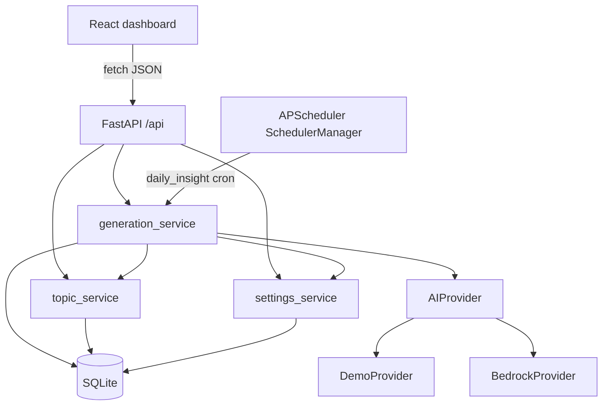
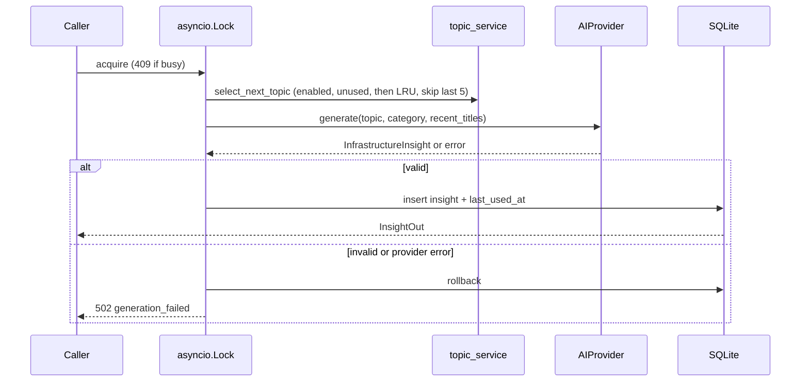
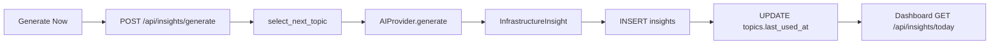

# Architecture

This document describes the **implemented** local system, not an idealized future design.

## System components



| Component | Location | Role |
| --- | --- | --- |
| UI | `frontend/src` | Dashboard, Today, History, Topics, Settings |
| API | `backend/app/api/routes.py` | HTTP surface, mounted at `/api` |
| Orchestrator | `backend/app/services/generation_service.py` | Lock, select topic, call AI, validate, commit |
| Scheduler | `backend/app/scheduler/manager.py` | One cron job; skip if today exists |
| AI | `backend/app/ai/` | Provider ABC + demo + Bedrock |
| DB | SQLAlchemy models in `backend/app/models/entities.py` | SQLite file |

## Frontend architecture

- Vite + React 19 + TypeScript
- React Router routes in `frontend/src/App.tsx`
- Typed client `frontend/src/services/api.ts` (`VITE_API_BASE` + `/api/...`)
- In `npm run dev`, Vite proxies `/api` to `http://127.0.0.1:8000` (or `VITE_PROXY_TARGET`)
- Production static builds must set `VITE_API_BASE` to the backend origin at build time
- Pages call `/api/status`, `/api/insights/*`, `/api/topics`, `/api/settings`

Layout: `AppShell` with a telemetry ticker (scheduler label, next run, last success, provider).

## Backend architecture

`create_app()` in `backend/app/main.py`:

1. CORS from `CORS_ORIGINS`
2. Exception handlers for `InfraPulseError` and request validation
3. Router prefix `/api`
4. Lifespan: logging, `init_db()`, seed topics/settings, start scheduler if env `SCHEDULER_ENABLED` is true

Configuration is `pydantic-settings` (`backend/app/core/config.py`) from environment and optional `backend/.env`. Runtime toggles (provider, demo mode, schedule time, timezone, scheduler enabled) are also stored in the `settings` table and can override what the UI displays after seed.

## Agent workflow

Manual (`POST /api/insights/generate`) and scheduled (`POST /api/scheduler/run` / cron) share `_generate`:



Scheduled path calls `run_scheduled_generation` first: if `get_today_insight` finds a row in the current timezone day, it returns `skipped: true, reason: today_exists` and does not generate.

## AI provider abstraction

`AIProvider.generate(topic, category, recent_titles) -> InfrastructureInsight`

- `DemoProvider`: catalog lookup by topic, then category, then any entry; validates with Pydantic
- `BedrockProvider`: `bedrock-runtime` `converse`, JSON parse, same Pydantic model
- Factory: demo wins if `demo_mode` is true or name is `demo`

Generated content is never executed. Bedrock responses that are not valid JSON or fail schema checks become `GenerationFailedError`.

## Database architecture

SQLAlchemy `create_all` on startup (no Alembic in this repo).

### `insights`

`id`, `title`, `topic`, `category`, `summary`, `real_world_scenario`, `technical_explanation`, `architecture`, `best_practices` (JSON list), `practical_recommendation`, `common_mistakes` (JSON), `what_to_learn_next` (JSON), `tags` (JSON), `generated_at`, `generation_source` (`demo` or `bedrock`).

### `topics`

`id`, `name` (unique), `category`, `enabled`, `last_used_at`. Seeded from `backend/app/db/catalog.py`.

### `settings`

`key` / `value` strings: `ai_provider`, `scheduler_enabled`, `schedule_time`, `timezone`, `demo_mode`.

Naive SQLite datetimes are treated as UTC when serialized (`ensure_utc` in `insight_service`).

## Scheduler

`AsyncIOScheduler` job id `daily_insight`, `max_instances=1`, `coalesce=True`. Cron from `schedule_time` + `timezone`. Last run fields are **in-process memory**, not a database table; they reset when the process restarts.

## API communication

JSON over HTTP. Error envelope:

```json
{ "error": { "code": "not_found", "message": "..." } }
```

Codes: `not_found` (404), `conflict` (409), `generation_in_progress` (409), `generation_failed` (502), `validation_error` (422).

## Error handling

- Provider and unexpected generate errors → rollback + 502
- DB write errors → rollback + logged
- Concurrent generate → 409 without starting a second provider call
- Request body validation → 422 from FastAPI `RequestValidationError`

## Data flow (Generate Now)


